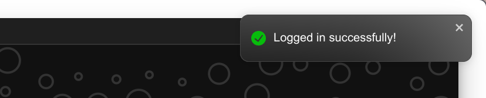

# Customer Query Resolution application by Mohit Pathak

## The application can be accessed at [http://34.131.229.9/](http://34.131.229.9/)

## Demo video can be viewed [Here](https://youtu.be/AJab_fKr_Wo)

### Login details:

**User mode:** 208@user.com, 218@user.com, 444@user.com, 676@user.com, 779@user.com, 1092@user.com,
1155@user.com, 1241@user.com, 1245@user.com, 1354@user.com, 1481@user.com, 2035@user.com, 2126@user.com, 2517@user.com, 2780@user.com, 2788@user.com, 2884@user.com, 2926@user.com, 2983@user.com, 3056@user.com, 3091@user.com, 3112@user.com, 3170@user.com, 3643@user.com, 3701@user.com, 3725@user.com, 3775@user.com, 3897@user.com, 3900@user.com, 4178@user.com, 4373@user.com, 4442@user.com, 4481@user.com, 4522@user.com, 4708@user.com, 5000@user.com, 5297@user.com, 5480@user.com, 5696@user.com, 5724@user.com, 6054@user.com, 6326@user.com, 6515@user.com, 6884@user.com, 7140@user.com, 7457@user.com, 7725@user.com, 7812@user.com, 7837@user.com, 7944@user.com, 8014@user.com, 8101@user.com, 8125@user.com, 8392@user.com, 8647@user.com

**Agent mode:** 1@agent.com, 2@agent.com, 3@agent.com, 4@agent.com, 5@agent.com, 6@agent.com, 7@agent.com, 8@agent.com, 9@agent.com, 10@agent.com, 11@agent.com, 12@agent.com, 13@agent.com, 14@agent.com, 15@agent.com, 16@agent.com, 17@agent.com, 18@agent.com, 19@agent.com, 20@agent.com, 21@agent.com, 22@agent.com, 23@agent.com, 24@agent.com, 25@agent.com, 26@agent.com, 27@agent.com, 28@agent.com, 29@agent.com, 30@agent.com

---

## Features implemented

- Agent Interface and Customer Interface
  
  
- Intuitive UI for user and customer agent
  
- Feature for user to add new queries and a way to prioritise these new queries; User can select a total of 16 different cases (4 issues x 4 subissues) comprising different issues having different prioritties
  
- Way for customer agents to keep any eye on the incoming messages and prioritising urgent issues
  - The chats having highest priority and are most recent displayed on the top
  - Implemented pagination so that only a handful of selected chats are fetched at a time from the server
  - The customer agent can select a chat request to resolve, After selection the chat is removed from the "new chats request" table thereby avoiding multiple agents to work on same chat simultaneously
    
- Realtime chat between user and customer agent. Even when either side is offline the messages are not lost and stored in DB which are then fetched when a user clicks to open the chat
  
- Also implemented the online status of users
  
- The agent or user can mark the chat as resolved. Once resolved, The chat will be read-only. The user and agent both can view the resolved chats by going to the resolved section
  
- Implemented New chat request notification for agents and new messages notifications
  
  
- Populated the DB with the chats provided in the CSV files (Gives some extra attributes to rows to fit the data model)
- Dockerized the application (consisting of 5 containers viz Frontend(ReactJS), Backend: Stateless Application server(NodeJS), Backend: Stateful websocket server, Database: MySQL(For relational data), MongoDB(For storing the chats)). Running the application requires just one command `docker compose up --build`.
- Added notification and loader to improve the UX
  

---

## Architecture


---

## Setting up the application on local machine

### Requirements

- [Git](https://git-scm.com/downloads) and [docker](https://get.docker.com/)

#### Steps

1. Clone the GitHub repo on your local machine

```bash
git clone https://github.com/aystic/CustomerQueryResolution.git
```

2. Navigate inside the cloned repo

```bash
cd CustomerQueryResolution
```

3. Run the docker compose command

```bash
docker compose -f ./docker-compose.dev.yaml up --build
```

4. Run the following command for mongoDB chat migration

```bash
docker container exec -it customerqueryresolution-db_mongodb-1 mongoimport --type=csv -d BranchBackend -c chats  --columnsHaveTypes --fields 'chatID.int64(),userID.int64(),agentID.int64(),type.string(),sender.string(),timestamp.string(),message.string()' --file=ChatsMongo.csv
```

If step 4 fails then check the name of the docker container for the mongoDB database using

```bash
docker container ls -a
```

---
